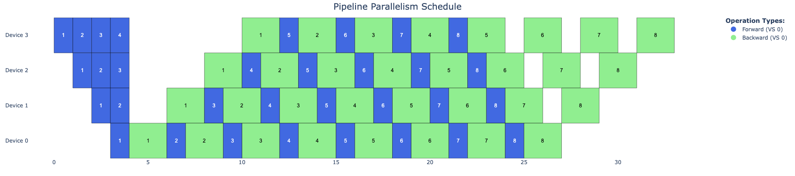
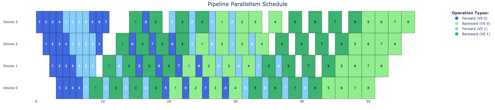
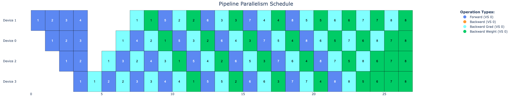
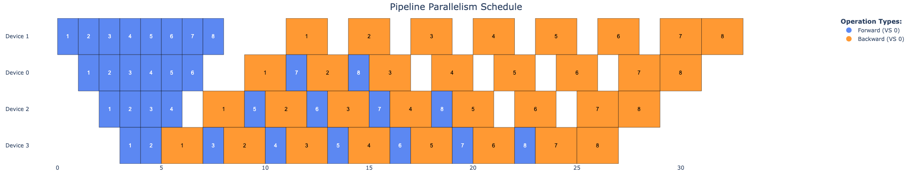

# Pipeline Parallelism Emulation

This project provides tools for emulating and visualizing pipeline parallelism strategies used in large language model training.

## Overview

Pipeline parallelism is a technique used to train large models by partitioning the model across multiple devices and processing data in a pipelined fashion. This project allows you to:

- Simulate different pipeline parallelism strategies (1F1B, Interleaved)
- Visualize the execution schedule on multiple devices
- Compare different strategies for efficiency

## Features
- Supported Pipeline Stragegies:
    - 1F1B
    - Interleaved 1F1B
- Visualization:
    - Interactive visualization dashboard using Plotly/Dash
- Config:
    - Configurable simulation parameters through Hydra
    - Each stage

## Installation

This project uses [uv](https://github.com/astral-sh/uv) for dependency management.

Setup `uv` if not installed in your computer:
```
# On macOS and Linux.
curl -LsSf https://astral.sh/uv/install.sh | sh
```

## Usage

Running for 1F1B strategy:
```bash
uv run python main.py strategy=1f1b num_devices=4 num_stages=4 num_batches=8
```


Running for interleave strategy:
```bash
uv run python main.py strategy=interleave num_devices=4 num_stages=8 num_batches=8
```


Running for ZB-1P strategy:
```bash
uv run python main.py strategy=zb1p num_devices=4 num_stages=4 num_batches=8
```



Running for 1F1B-batch-overlap strategy:
```bah
uv run python main.py strategy=1f1b_overlap num_devices=4 num_stages=4 num_batches=8
```


## Configuration

The default configuration is in `conf/config.yaml`. You can override any parameter on the command line or create configuration groups for different scenarios.

### Using Different Configuration Files

You can use different configuration files with Hydra in several ways:

#### Recommended Approach

1. Create multiple configuration files in the `conf` directory for different use cases:
   ```
   conf/
   ├── config.yaml     # Default configuration
   └── model_A.yaml    # Create your own config with stage-specific latency for performance projection.
   ```

2. Run with your desired configuration using the `--config-name` flag:
   ```bash
   uv run python main.py --config-name=model_A
   ```

#### Override Specific Parameters

You can also override specific parameters at runtime:
```bash
uv run python main.py op_times.forward=0.5 op_times.backward=1.0 num_batches=6
```

## Project Structure

```
PP-Emulation/
├── conf/                   # Hydra configuration files
│   └── config.yaml         # Default configuration
├── src/                    # Source code
│   ├── __init__.py         # Package initialization
│   ├── execution_model.py  # Schedule execution models
│   ├── strategies.py       # Pipeline parallelism strategies
│   └── visualizer.py       # Visualization utilities
├── main.py                 # Main entry point
├── pyproject.toml          # Project metadata and dependencies
└── README.md               # This file
```

## License

This project is licensed under the MIT License - see the LICENSE file for details.

## Contributing

Contributions are welcome! Please feel free to submit a Pull Request. 