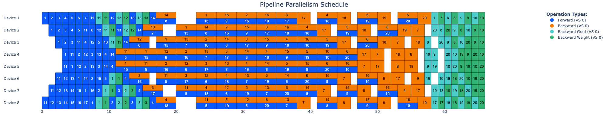
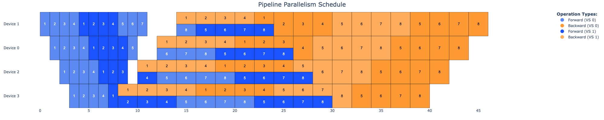

# Pipeline Parallelism Emulation and Visualization

This project provides tools for emulating and visualizing pipeline parallelism strategies used in large language model training.

## Online Demo

**Try it online!** This tool is deployed and accessible on Hugging Face Spaces:

🔗 **[https://huggingface.co/spaces/Victarry/PP-schedule-visualizer](https://huggingface.co/spaces/Victarry/PP-schedule-visualizer)**

No installation required - just visit the link and start exploring pipeline parallelism scheduling strategies directly in your browser!

## Overview

Pipeline parallelism is a technique used to train large models by partitioning the model across multiple devices and processing data in a pipelined fashion. This project allows you to:

- Simulate different pipeline parallelism strategies (1F1B, Interleaved, Zero-Bubble, etc.)
- Visualize the execution schedule on multiple devices
- Compare different strategies for efficiency

## Features

- **Supported Pipeline Strategies**:
  - 1F1B (One-Forward-One-Backward)
  - Interleaved 1F1B
  - Zero-Bubble 1F1B (ZB-1P)
  - 1F1B with computation-communication overlap
  - Interleaved 1F1B with computation-communication overlap
  - DualPipe (Bidirectional pipeline parallelism with full forward-backward overlap)

- **Visualization**:
  - Interactive visualization dashboard using Plotly/Dash
  
- **Configuration**:
  - Configurable simulation parameters through Hydra
  - Customizable stage latency and communication costs

## Installation

This project uses [uv](https://github.com/astral-sh/uv) for dependency management.

Setup `uv` if not installed on your computer:
```bash
# On macOS and Linux
curl -LsSf https://astral.sh/uv/install.sh | sh
```


## Running the Interactive Server

To visualize schedules interactively:

```bash
uv run src/server.py
```

This will start a Dash server (usually on `http://127.0.0.1:8050/`). Open this URL in your web browser.

You can then adjust parameters like the number of devices, stages, batches, operation times, and select different scheduling strategies to see the resulting pipeline visualization.

## Running from Command Line

### Running for 1F1B strategy:
```bash
uv run python main.py strategy=1f1b num_devices=4 num_stages=4 num_batches=8
```


### Running for interleaved strategy:
```bash
uv run python main.py strategy=interleave num_devices=4 num_stages=8 num_batches=8
```


### Running for ZB-1P strategy:
```bash
uv run python main.py strategy=zb1p num_devices=4 num_stages=4 num_batches=8
```


### Running for DualPipe strategy:
```bash
uv run python main.py strategy=dualpipe num_devices=8 num_stages=8 num_batches=20
```


### Running for 1F1B-batch-overlap strategy:
```bash
uv run python main.py strategy=1f1b_overlap num_devices=4 num_stages=4 num_batches=8
```


### Running for 1F1B-interleave-overlap strategy:
```bash
uv run python main.py strategy=1f1b_interleave_overlap num_devices=4 num_stages=8 num_batches=8
```



## Configuration

The default configuration is in `conf/config.yaml`. You can override any parameter on the command line or create configuration groups for different scenarios.

#### Override Specific Parameters

You can override specific parameters at runtime:
```bash
uv run python main.py op_times.forward=0.5 op_times.backward=1.0 num_batches=6
```

Use DualPipe as an example, you can manually set different time for forward/backward/backward_D/backward_W/overlapped_forward_backward:
```bash
uv run python main.py strategy=dualpipe num_devices=8 num_stages=8 num_batches=32 op_times.forward=1.0 op_times.backward=2.0 op_times.backward_D=1.0 op_times.backward_W=1.0 op_times.overlapped_forward_backward=2.5
```


### Using Different Configuration Files

You can use different configuration files with Hydra in several ways:

#### Recommended Approach

1. Create multiple configuration files in the `conf` directory for different use cases:
   ```
   conf/
   ├── config.yaml     # Default configuration
   └── model_A.yaml    # Create your own config with stage-specific latency for performance projection
   ```

2. Run with your desired configuration using the `--config-name` flag:
   ```bash
   uv run python main.py --config-name=model_A
   ```


## Project Structure

```
PP-Emulation/
├── conf/                   # Hydra configuration files
│   └── config.yaml         # Default configuration
├── src/                    # Source code
│   ├── __init__.py         # Package initialization
│   ├── execution_model.py  # Schedule execution models
│   ├── strategies.py       # Pipeline parallelism strategies
│   └── visualizer.py       # Visualization utilities
├── main.py                 # Main entry point
├── pyproject.toml          # Project metadata and dependencies
└── README.md               # This file
```

## References

1. _PipeDream: Fast and Efficient Pipeline Parallel DNN Training_. [arxiv](https://arxiv.org/abs/1806.03377)
2. _Efficient Large-Scale Language Model Training on GPU Clusters Using Megatron-LM_. [arxiv](https://arxiv.org/abs/2104.04473)
3. _Zero Bubble Pipeline Parallelism_. [arxiv](https://arxiv.org/abs/2401.10241)
4. _Communication-Computation Overlap in MoE Training with 1F1B Pipeline Parallelism_. [blog](https://zhuanlan.zhihu.com/p/28463368206)

## License

This project is licensed under the MIT License - see the LICENSE file for details.

## Contributing

Contributions are welcome! Please feel free to submit a Pull Request. 