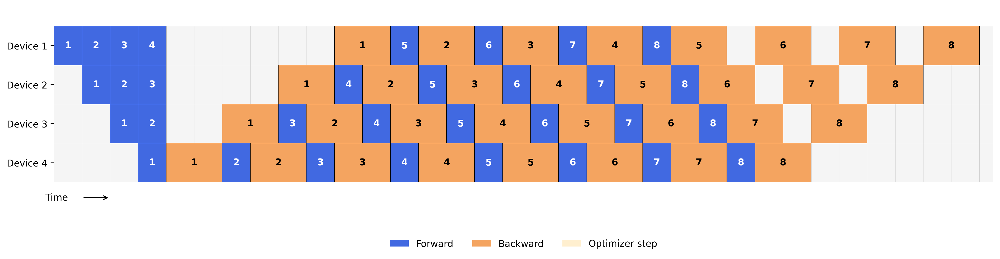

# Pipeline Parallelism Scheduler and Visualizer

This tool simulates and visualizes pipeline parallelism scheduling strategies, focusing on the 1F1B (One-Forward-One-Backward) scheduling algorithm commonly used in distributed deep learning.

## Usage

### Example Output

```bash
python pipeline.py --num-stages 4 --num-batches 8
```


### Command Line Interface

| Option | Short | Description |
|--------|-------|-------------|
| `--config` | `-c` | Path to config file (JSON or YAML) |
| `--num-stages` | `-s` | Number of pipeline stages (devices) |
| `--num-batches` | `-b` | Number of micro-batches |
| `--forward-times` | `-f` | Time for forward pass at each stage (space-separated list) |
| `--backward-times` | `-bw` | Time for backward pass at each stage (space-separated list) |
| `--output` | `-o` | Output file path for visualization |
| `--no-visualization` | | Skip visualization generation |
| `--p2p-time`| | P2P communication time of PP |

### Using Configuration Files

You can use either JSON or YAML configuration files:

Example JSON configuration (sample_config.json):
```json
{
    "num_stages": 6,
    "num_batches": 12,
    "forward_times": [0.8, 1.0, 1.2, 1.0, 0.9, 1.1],
    "backward_times": [1.6, 2.0, 2.4, 2.0, 1.8, 2.2],
    "output_file": "pipeline_1f1b_custom.png"
}
```

Example YAML configuration (sample_config.yaml):
```yaml
# Pipeline Parallelism Configuration
num_stages: 5
num_batches: 8
forward_times:
  - 0.9
  - 1.1
  - 1.0
  - 0.8
  - 1.2
backward_times:
  - 1.8
  - 2.2
  - 2.0
  - 1.6
  - 2.4
output_file: "pipeline_1f1b_yaml.png"
```

## About Pipeline Parallelism

Pipeline parallelism is a distributed deep learning training strategy that splits model layers across multiple devices. Each device processes a different stage of the neural network, creating a pipeline where multiple micro-batches can be processed simultaneously.

The 1F1B (One-Forward-One-Backward) scheduling algorithm is an efficient strategy for pipeline parallelism that balances throughput with memory usage. It follows these phases:
1. **Warmup Phase**: Forward passes for the first several micro-batches
2. **Steady State**: Each device alternates between forward and backward passes
3. **Cooldown Phase**: Backward passes to complete the computation for remaining micro-batches

The "bubble rate" metric measures the inefficiency in the pipeline, representing the percentage of time devices spend idle waiting for dependencies.

## References

- PipeDream: Generalized Pipeline Parallelism for DNN Training (SOSP'19)
- GPipe: Efficient Training of Giant Neural Networks using Pipeline Parallelism (NeurIPS'19)
- Megatron-LM: Training Multi-Billion Parameter Language Models Using Model Parallelism 