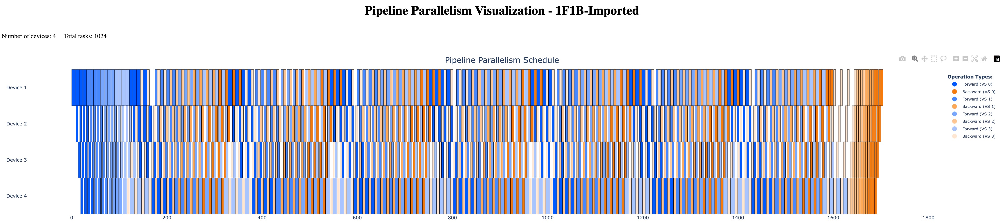

# Pipeline Parallelism Visualization for Megatron-LM

This tool provides visualization capabilities for Pipeline Parallelism (PP) scheduling in Megatron-LM training, helping you analyze load balancing issues and debug abnormal PP bubble problems that are difficult to inspect directly from Nsight Systems profiling.

## Overview

The visualization tool offers intuitive visual representation of PP scheduling, making it easier to:
- Identify load balancing issues across pipeline stages
- Debug PP bubble problems
- Analyze pipeline efficiency and bottlenecks
- Optimize pipeline parallelism configurations

## Prerequisites

- Megatron-LM with PP timer support
- Python environment with required dependencies
- UV package manager (recommended)

## Usage

### Step 1: Enable PP Timer in Megatron-LM

First, you need to apply the PP timer patch to your Megatron-LM installation:

1. Cherry-pick the commit from the modified Megatron-LM repository:
   ```bash
   # Navigate to your Megatron-LM directory
   cd /path/to/Megatron-LM
   
   # Cherry-pick the PP timer commit
   git remote add victarry https://github.com/Victarry/PP-Schedule-Visualization.git
   git fetch victarry
   git cherry-pick ad3bc3a22adc79827dc1b35619ad6813078e621b
   ```
   
   **Note**: The commit can be viewed at: https://github.com/Victarry/Megatron-LM/commit/ad3bc3a22adc79827dc1b35619ad6813078e621b

### Step 2: Configure Environment Variables

Set the following environment variables before running your training script:

```bash
# Enable PP timer functionality
export ENABLE_PP_TIMER=1

# Specify which iteration to dump (e.g., iteration 1)
export ENABLE_PP_TIMER_ITER=1

# Set directory to save the dumped timer results
export PP_TIMER_LOG_DIR=/path/to/save/timer/logs

# Run your training script
bash your_training_script.sh
```

### Step 3: Generate Visualization

Once you have collected the timer data, use the visualization script:

```bash
# Navigate to the PP-Schedule-Visualization directory
cd /path/to/PP-Schedule-Visualization

# Set your configuration parameters
PP_SIZE=4        # Number of pipeline parallel stages
VPP_SIZE=1       # Virtual pipeline parallel size (usually 1)
DATA_DIR=/path/to/timer/logs  # Directory containing the dumped timer data

# Run the visualization script
uv run examples/megatron-lm/plot.py --data-dir $DATA_DIR --pp-size $PP_SIZE --vpp-size $VPP_SIZE
```

**Parameters:**
- `--data-dir`: Path to the directory containing PP timer log files
- `--pp-size`: Number of pipeline parallel stages in your training setup
- `--vpp-size`: Virtual pipeline parallel size (typically 1 unless using virtual PP)

### Example Output

After running the visualization script, you will see a detailed PP schedule visualization similar to:



The visualization shows:
- Timeline of each pipeline stage
- Forward and backward pass scheduling
- Bubble time and idle periods
- Communication overhead between stages

## Known Issue
- If the global batch size is very large, it may takes > 1 minutes to see the visualization results.

## Contributing

If you encounter issues or have suggestions for improvements, please open an issue or submit a pull request.
